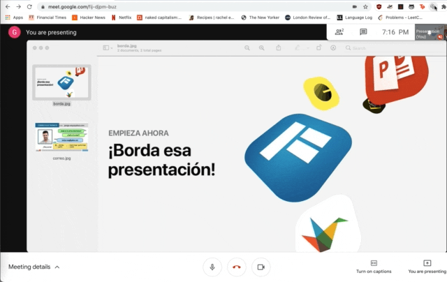

<h1 align="center">🚩 Transmit 🚩</h1>

Translate text in HTML5 videos into any language

## Quick Start

Ensure you have

- [Node.js](https://nodejs.org) 10 or later installed
- [Yarn](https://yarnpkg.com) v1 or v2 installed

Install server dependencies and start:

- `cd server`
- `pip install -r requirements.txt`
- `uvicorn api:app --reload`

Then run the following:

- `yarn install` to install dependencies.
- `yarn run dev:chrome` to start the development server for chrome extension
- `yarn run build:chrome` to build chrome extension

## License

Based on [web-extension-starter](https://github.com/abhijithvijayan/web-extension-starter) by @abhijithvijayan
